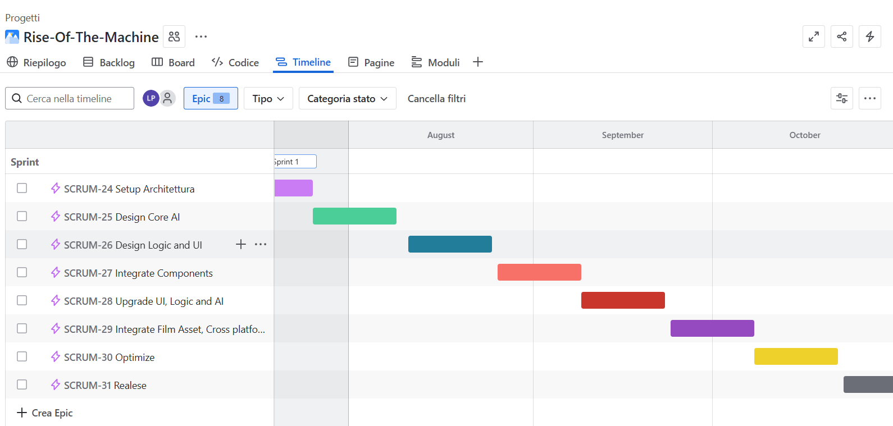

# Monitor & Controlling Process

L'obiettivo del sistema di monitoraggio e controllo è fornire informazioni dettagliate e tempestive sullo stato di 
avanzamento del progetto, minimizzando l'overhead operativo sul team e abilitando una gestione proattiva delle criticità
attraverso strumenti automatizzati e processi efficienti.

## Strumenti e Sistemi di Supporto

Il monitoraggio del progetto si baserà su JIRA come piattaforma principale, sfruttando le sue funzionalità avanzate per 
il tracciamento delle issues e la misurazione dell'effort. Ogni membro del team avrà accesso al proprio workspace 
personalizzato, dove le attività saranno organizzate secondo un workflow a quattro stati: To-do per i task assegnati 
ma non ancora avviati, In Progress per le attività in lavorazione, Testing per quelle completate ma in fase di verifica,
e Done per i task definitivamente chiusi.

La misurazione dell'effort seguirà un approccio incrementale basato su ore lavorative effettive, permettendo agli 
sviluppatori di registrare progressivamente il tempo investito al termine di ogni sessione di lavoro o alla chiusura 
dell'attività. Questo sistema consente un tracking preciso e in tempo reale del consumo di risorse, facilitando la 
identificazione precoce di scostamenti rispetto alle stime iniziali.

## Sistema di Reporting

Il reporting sarà completamente automatizzato attraverso gli strumenti di intelligenza artificiale integrati in JIRA, 
che analizzeranno effort registrati e tag delle issues per generare un quadro complessivo dello stato del progetto. Il 
sistema produrrà principalmente cumulative reports focalizzati sulla sprint corrente per analizzare i trend di avanzamento,
ed exception reports per evidenziare situazioni anomale o critiche che richiedono attenzione immediata.

La scelta di privilegiare report orientati ai trend piuttosto che al monitoraggio giornaliero riflette l'approccio 
top-down adottato, dove l'osservazione di dati aggregati e risultati strategici prevale sulla micro-gestione operazionale,
consentendo al team di mantenere il focus sugli obiettivi di alto livello.

## Issues Log e Gestione Problematiche

La gestione delle problematiche emerge naturalmente dall'integrazione con JIRA, dove ogni issue viene tracciata con 
informazioni complete includendo ID univoco, data di apertura, descrizione dettagliata con soluzione proposta, 
stato corrente nel workflow, e effort effettivamente investito. Questo approccio integrato elimina la necessità di 
mantenere sistemi separati e garantisce che tutti i problemi siano gestiti con lo stesso livello di visibilità e 
controllo delle normali attività di sviluppo.

**[🔍 Visualizza a dimensione completa](../img/Jira.png)**

## Meeting e Review

L'automazione del reporting riduce significativamente la necessità di meeting operazionali frequenti, permettendo di 
concentrare gli sforzi comunicativi su Project Review Meetings strategici organizzati al completamento di ogni 
macro-fase di sviluppo. Questi incontri si focalizzano sull'analisi del progresso complessivo e sulla risoluzione 
di problemi di alto livello, seguendo prevalentemente un approccio project manager-based che riflette i vincoli di 
budget e la necessità di ottimizzare l'utilizzo delle risorse limitate disponibili, rendendo l'escalation verso 
risorse aggiuntive un'opzione da considerare solo in situazioni critiche.