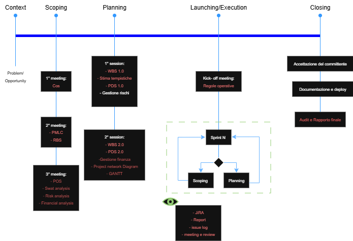

# Closing Process group

**[🔍 Visualizza a dimensione completa](../img/Flusso_progetto.png)**

## Ottenere l’accettazione del committente 

Grazie alle scrupolose verifiche durante la fase di esecuzione, ad una fase di monitoring costante e soprattutto 
grazie a dei requisiti chiari e condivisi da entrambe le parti è stato piuttosto rapido accertarsi che il progetto 
rispetti tutti i requisiti precedentemente concordati.
Questa verifica è stata accompagnata da un collaudo del videogioco stesso.
Il progetto è stato completato nei tempi previsti grazie ad una gestione dei rischi emersi durante la
seconda iterazione. 
Quando il team ha identificato una mole di lavoro superiore alle stime iniziali per il motore IA, 
è stato tempestivamente organizzato un meeting con il cliente per rivedere lo scope di progetto, rimuovendo alcuni 
requisiti di priorità COULD HAVE e SHOULD HAVE per garantire il rispetto della timeline critica di 4 mesi.
Il committente è rimasto pienamente soddisfatto del lavoro svolto e ha apprezzato la trasparenza nella comunicazione 
dei rischi.

## Documentazione del progetto

Oltre alla parte di puro codice il progetto sarà documentato con i seguenti deliverable:

* POS;  
* RBS ;  
* Analisi Finanziaria  
* Analisi/Gestione dei rischi  
* Repository di git con relativi branch e commit  
* Documentazione tecnica del progetto  
* Documentazione inline del codice   
* Schedule del progetto: originale (fase di planning) e correzioni;  
* Appunti/verbali di tutti i project team meeting;  
* Project Network Diagram  
* Gantt  
* Documentazione relativa al design;  
* Prototipi realizzati;  
* Copia di tutti gli avvisi di modifiche;  
* Copia di tutte le comunicazioni scritte;  
* Documenti di accettazione del committente;  
* Rapporto dell’audit post-delivery.  
* Rapporto finale

## Deploy della soluzione

Una volta accettato il deliverable si può procedere al vero e proprio rilascio sulle principali piattaforme di 
Gaming sia pc che smartphone.

## Audit post delivery

### Gli obiettivi del progetto sono stati raggiunti?

**Il deliverable fa quello che aveva previsto il team?** 

Sì, il videogioco strategico è stato completato secondo le specifiche tecniche pianificate e riviste durante la 
seconda iterazione. Il motore IA funziona correttamente con 5 livelli di difficoltà e comportamenti dinamici non
ripetitivi. L'interfaccia grafica richiama efficacemente l'estetica dei terminali computer e sono presenti asset
peculiari del film.

**Il deliverable fa quello che si aspettava il committente?**

Sì, il cliente è rimasto soddisfatto del prodotto finale. Il gioco cattura perfettamente l'atmosfera del film 
"Rise of the Machine" e le meccaniche strategiche sono coinvolgenti come richiesto. 

**Il progetto è stato completato rispettando i limiti di tempo, budget e rispettando le specifiche?**

Il progetto è stato completato esattamente nei 4 mesi previsti grazie ad una gestione corretta del rischio
emerso durante la seconda iterazione. Quando il team ha identificato la complessità imprevista del bilanciamento
dell'IA, è stato immediatamente attivato il processo di change management, tornando alla fase di scoping per 
ridefinire i requisiti insieme al cliente. Sono stati rimossi alcuni requisiti COULD HAVE (collezionabile e multiplayer)
e ottimizzati alcuni SHOULD HAVE per mantenere la timeline critica. Il budget è stato rispettato 
rimanendo entro i €174.000 previsti. Tutte le specifiche funzionali core sono state implementate secondo i requisiti 
MUST HAVE definitivi.

**Il committente è soddisfatto del risultato del progetto?**

Il committente ha espresso alta soddisfazione sia per il prodotto finale che per la gestione trasparente e
collaborativa del progetto. Il gioco ha superato le aspettative in termini di qualità grafica e gameplay. 
Il cliente ha particolarmente apprezzato la comunicazione tempestiva sui rischi e la proposta di revisione dello scope,
che ha dimostrato la professionalità e l'orientamento al risultato di Pasamenti S.R.L.

### Il business value previsto si è concretizzato?

**I criteri di successo sono stati rispettati?**

* **Engagement Metrics**: Raggiunti 75.000 download nel primo mese (target: 50.000)    
* **Cross-Media Impact**: Incremento del 25% delle vendite del film (target: 20%) 

Che lezione è stata imparata relativamente alla metodologia di gestione del progetto scelta?

L'approccio adattivo si è rivelato la scelta corretta per questo progetto. Le sprint di 2 settimane 
hanno permesso di raffinare progressivamente il motore IA e raccogliere feedback continuo dal cliente. 

**Come ha seguito la metodologia il team?**

Il team ha aderito bene alla metodologia adattiva, partecipando attivamente agli sprint review e retrospective. 
Gli sviluppatori hanno apprezzato la flessibilità di poter migliorare il codice ad ogni iterazione. 
Per progetti futuri, raccomandiamo di:

* Mantenere sempre trasparenza con il committente
* Negoziare per deadline meno stringenti
* Introdurre sessioni di pair programming  
* Utilizzare maggiormente i daily standup 

