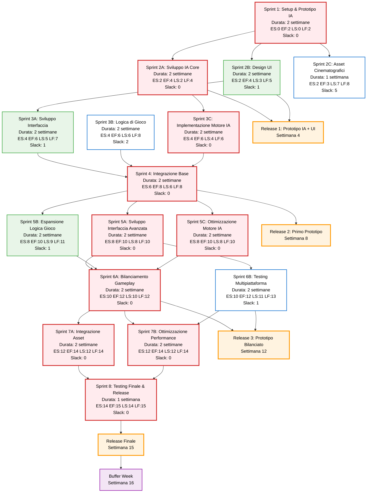

# Project Network Diagram

## **Legenda**

**Critical Path (rosso):**

Questi task hanno slack \= 0 e determinano la durata minima del progetto

**Task con Slack (verde):** 

Hanno margine di manovra per ritardi senza impattare il progetto

**Task normale (bianco):** 

Hanno molto slack e possono essere posticipati
