# RBS - Requirements Breakdown Structure

```mermaid
graph TD
    A[Videogioco Completo] --> B[REQUISITI FUNZIONALI]
    A --> C[REQUISITI NON FUNZIONALI]
    A --> D[DESIGN ARCHITETTURALE]
    A --> E[MARKETING INTEGRATION]
    A --> F[REQUISITI DI PROGETTO]
    
    B --> B1[Logica di Gioco]
    B --> B2[Interfaccia Grafica]
    B1 --> B1a[Motore IA Strategica]
    B1 --> B1b[Gestione Stato di Gioco]
    B2 --> B2a[Design Terminali Computer]
    B2 --> B2b[Sistema di Input Utente]
    
    C --> C1[Usabilità]
    C --> C2[Affidabilità]
    C1 --> C1a[User Experience]
    C1 --> C1b[Accessibilità]
    C2 --> C2a[Zero Crash]
    C2 --> C2b[Gestione degli Errori]
    
    D --> D1[Qualità del Codice]
    D --> D2[Struttura Modulare]
    D1 --> D1a[Testing]
    D1 --> D1b[Controlli Statici]
    D2 --> D2a[Scala Doc]
    D2 --> D2b[Riferimenti al Film]
    
    E --> E1[Sinergia Cinematografica]
    E --> E2[Community Features]
    E1 --> E1a[Colonna Sonora del Film]
    E1 --> E1b[Sistema Challenge]
    
    F --> F1[Tecnologie]
    F --> F2[Deliverables]
    F1 --> F1a[Stack Tecnologico di Sviluppo]
    F1 --> F1b[Infrastruttura]
    F2 --> F2a[Documentazione Tecnica]
    F2 --> F2b[Demo Funzionale]
```

## Prioritizzazione (MoSCoW)

### **MUST HAVE (Requisiti Critici):**
* Tutti i requisiti funzionali 
* Tutti i requisiti di Affidabilità e usabilità
* Requisiti Stack Tecnologico di sviluppo, Infrastrutturale e Deliverable
* Marketing integration

### **SHOULD HAVE (Requisiti Importanti):**
* Requisiti Usabilità avanzata e Accessibilità
* Tutti i requisiti Design Patterns
* Requisiti Performance
* Requisiti Modularità
* Requisiti Qualità codice

### **COULD HAVE (Requisiti Desiderabili):**
* Audio e effetti sonori
* Animazioni avanzate
* Modalità multiplayer

### **WON'T HAVE (Fuori Scope):**
* Multiplayer online
* Grafica 3D avanzata
* Integrazione con servizi cloud